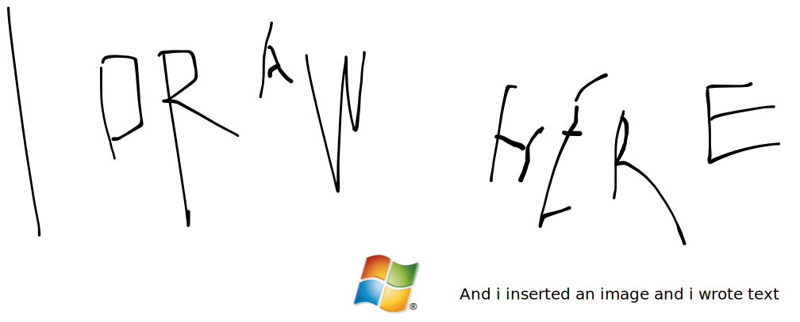

# Let's try the dev related stuff.

```csharp
using System;

namespace HelloWorld
{
  class Program
  {
    static void Main(string[] args)
    {
      Console.WriteLine("Hello World!");    
    }
  }
}
```

The c# code looks awesome!!!!!

<details>

<summary>Exception example expandable here</summary>

System.ApplicationException: Error during execute ---> System.FormatException: Input string was not in a correct format.   at System.Number.ThrowOverflowOrFormatException(ParsingStatus status, TypeCode type)   at System.Number.ParseInt32(ReadOnlySpan\`1 value, NumberStyles styles, NumberFormatInfo info)   at System.Int32.Parse(String s)   at MyNamespace.IntParser.Execute(String s) in C:\apps\MyNamespace\IntParser.cs:line 13   --- End of inner exception stack trace ---   at MyNamespace.IntParser.Execute(String s) in C:\apps\MyNamespace\IntParser.cs:line 17   at MyNamespace.Program.Main(String\[] args) in C:\apps\MyNamespace\Program.cs:line 13


</details>


[https://petstore.swagger.io/v2/swagger.json](https://petstore.swagger.io/v2/swagger.json)



[https://petstore.swagger.io/v2/swagger.json](https://petstore.swagger.io/v2/swagger.json)



[https://petstore.swagger.io/v2/swagger.json](https://petstore.swagger.io/v2/swagger.json)



[https://petstore.swagger.io/v2/swagger.json](https://petstore.swagger.io/v2/swagger.json)



[https://petstore.swagger.io/v2/swagger.json](https://petstore.swagger.io/v2/swagger.json)


openapi endpoints right in the documentation........!!!!









I don't know what it really fetches, some dummy data probably, but... perfect for the poc





oh we also have tabs



nice pretty tabs



and another one






Here is a hint: hints are good




